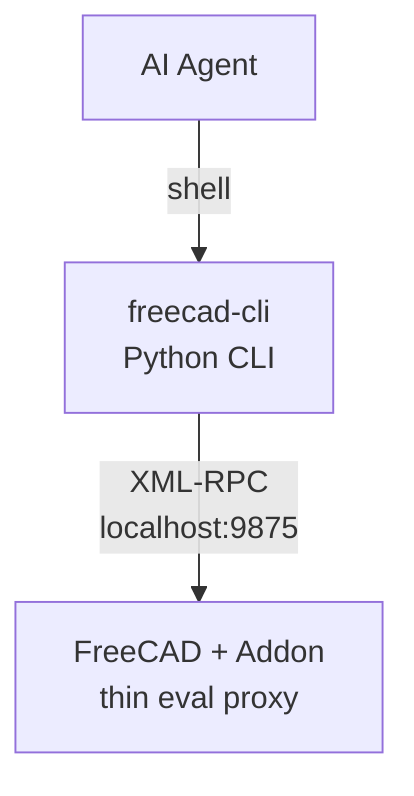

# freecad-cli

A Python CLI tool for controlling FreeCAD from AI Agents via shell. Communicates with FreeCAD over XML-RPC (port 9875).

## Architecture



The addon is a minimal XML-RPC server that runs inside FreeCAD. It only exposes `ping` and `execute_code` — all business logic lives in the CLI client. Once installed, the addon never needs to be updated. See [docs/architecture.md](docs/architecture.md) for design rationale and [docs/product-direction.md](docs/product-direction.md) for the command philosophy.

> **Security note:** `execute-code` runs arbitrary Python inside the FreeCAD process. The RPC server binds to `127.0.0.1` only — it is not accessible over the network. Only connect to a FreeCAD instance you control.

## Setup

### 1. Install the CLI

```sh
uv tool install -e .
```

### 2. Install the FreeCAD addon

```sh
freecad-cli install-addon
```

This creates a symlink from FreeCAD's Mod directory to the addon source. Restart FreeCAD after the first install — the RPC server will auto-start on every launch.

### 3. Verify

```sh
freecad-cli ping
```

## Usage

### execute-code

The core command. Sends Python code to FreeCAD for execution.

```sh
# Inline code
freecad-cli execute-code 'print(FreeCAD.ActiveDocument.Name)'

# Read from a file
freecad-cli execute-code --file script.py

# Pipe from stdin
cat script.py | freecad-cli execute-code -
echo 'print(1+1)' | freecad-cli execute-code -
```

### Other commands

```sh
freecad-cli ping
freecad-cli create-document MyDoc
freecad-cli active-document
freecad-cli screenshot --width 800
```

All commands return JSON output:

```json
{"status": "ok", "data": true}
```

## Development

### Setup

```sh
uv sync
git config core.hooksPath .githooks
```

### Install as a command

```sh
uv tool install -e .
```

Installed in editable mode — source code changes take effect immediately.

To uninstall:

```sh
uv tool uninstall freecad-cli
```

### Test

```sh
uv run pytest
```
